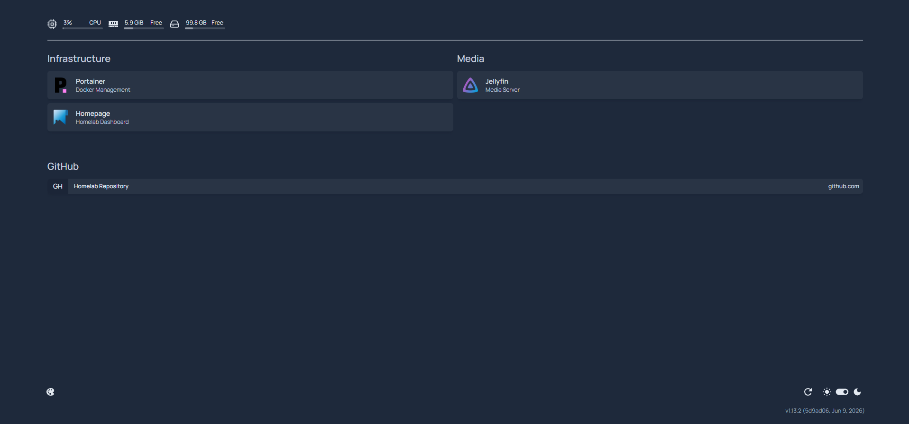
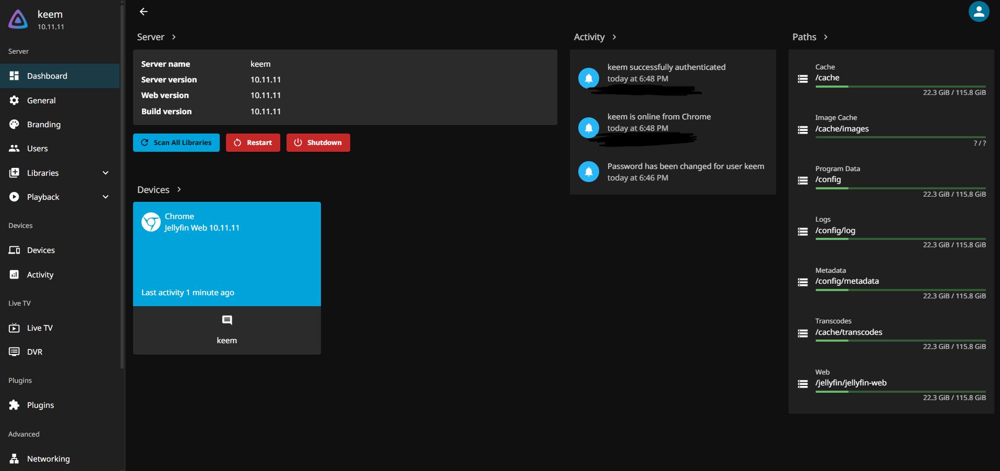
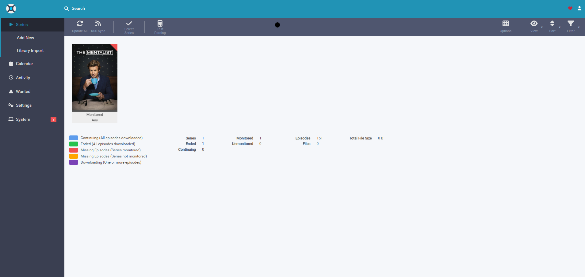
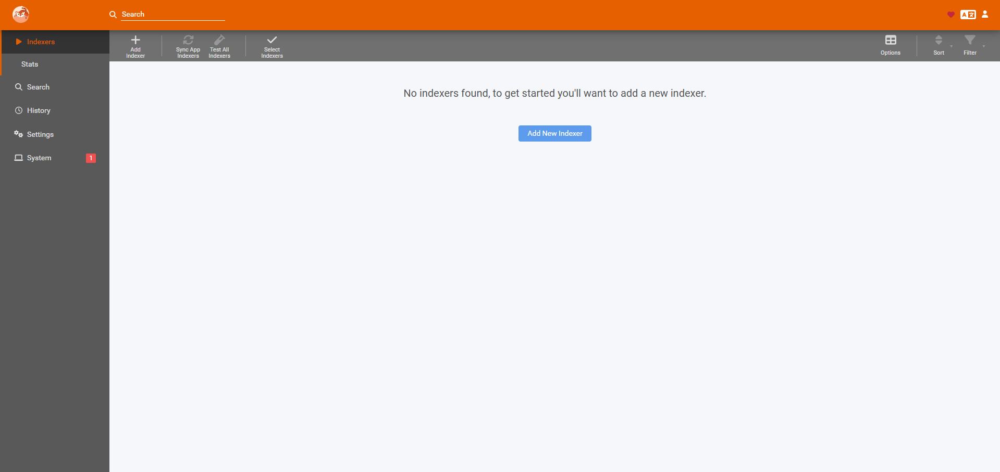

# 🏠 Homelab Documentation

A self-hosted homelab built using a **Qotom Mini PC** running **Ubuntu**.

This repository documents every service I deploy, the Docker Compose files used to deploy them, screenshots, and what I learned while building and maintaining my own infrastructure.

---

# Hardware

| Component | Specification |
|-----------|---------------|
| Mini PC | Qotom Intel Celeron J1900 |
| RAM | 8 GB DDR3 |
| Storage | 128 GB SSD |
| Operating System | Ubuntu Desktop 24.04 LTS |

---

# Technologies Used

- Ubuntu Linux
- Docker
- Docker Compose
- Portainer
- Tailscale
- Homepage
- Jellyfin
- Sonarr
- Radarr
- Prowlarr
- Git
- GitHub
- YAML

---

# Homelab Architecture

```text
                    Internet
                         │
                  Tailscale VPN
                         │
                Qotom Mini PC
                         │
                     Docker
                         │
      ┌─────────┬──────────┬──────────┬──────────┐
      │         │          │          │          │
 Portainer  Homepage   Jellyfin   Sonarr   Radarr
                                       │
                                   Prowlarr
```

---

# Installed Services

| Service | Status | Documentation |
|---------|:------:|--------------|
| Ubuntu Desktop | ✅ | Built-in |
| Docker | ✅ | Included |
| Docker Compose | ✅ | Included |
| Portainer | ✅ | docs/portainer.md |
| Jellyfin | ✅ | docs/jellyfin.md |
| Tailscale | ✅ | docs/tailscale.md |
| Homepage | ✅ | docs/homepage.md |
| Sonarr | ✅ | docs/sonarr.md |
| Radarr | ✅ | docs/radarr.md |
| Prowlarr | ✅ | docs/prowlarr.md |

---

# Docker Compose Files

Each service has its own Docker Compose configuration stored in:

```text
docker/
├── homepage/
├── jellyfin/
├── portainer/
├── prowlarr/
├── radarr/
└── sonarr/
```

---

# Documentation

Each service includes:

- Purpose
- Installation
- Docker Compose
- Configuration
- Authentication
- Screenshots
- What I Learned
- Future Improvements

Documentation is located in:

```text
docs/
├── homepage.md
├── jellyfin.md
├── portainer.md
├── prowlarr.md
├── radarr.md
├── sonarr.md
└── tailscale.md
```

---

# Screenshots

## Homepage



---

## Portainer


---

## Jellyfin



---

## Sonarr



---

## Radarr


---

## Prowlarr



---

## Tailscale


---

# Skills Learned

- Linux Administration
- Docker
- Docker Compose
- Container Networking
- YAML Configuration
- Docker Volumes
- Docker Bind Mounts
- Self-Hosting
- VPN Configuration
- Remote Server Management
- Git Version Control
- GitHub Documentation
- Service Documentation
- Media Server Administration

---

# Repository Structure

```text
Homelab-documentation/
│
├── docker/
│   ├── homepage/
│   ├── jellyfin/
│   ├── portainer/
│   ├── prowlarr/
│   ├── radarr/
│   └── sonarr/
│
├── docs/
│   ├── homepage.md
│   ├── jellyfin.md
│   ├── portainer.md
│   ├── prowlarr.md
│   ├── radarr.md
│   ├── sonarr.md
│   └── tailscale.md
│
├── screenshots/
│
└── README.md
```

---

# Current Roadmap

## ✅ Section 1 - Core Infrastructure

- [x] Ubuntu Desktop
- [x] SSH
- [x] NoMachine
- [x] Docker
- [x] Docker Compose
- [x] Portainer
- [x] Jellyfin
- [x] Tailscale
- [x] Homepage
- [x] Sonarr
- [x] Radarr
- [x] Prowlarr

---

## Section 2 - Infrastructure

- [ ] Uptime Kuma
- [ ] Watchtower
- [ ] Grafana
- [ ] Prometheus
- [ ] Automatic Backups

---

## Section 3 - Media Stack

- [ ] Bazarr
- [ ] Configure Sonarr
- [ ] Configure Radarr
- [ ] Configure Prowlarr
- [ ] Add External Storage
- [ ] Hardware Acceleration
- [ ] Mobile Streaming

---

# Future Goals

- Add a 4 TB external hard drive
- Expand the Jellyfin media library
- Learn Docker networking
- Learn reverse proxies
- Learn monitoring and observability
- Continue improving Linux administration skills
- Expand into DevOps and cloud technologies

---

# About This Project

This homelab is an ongoing learning project focused on developing practical experience with Linux, Docker, networking, self-hosting, automation, and infrastructure management. Every service is documented to create a repeatable deployment process and to track my progress as I continue learning.