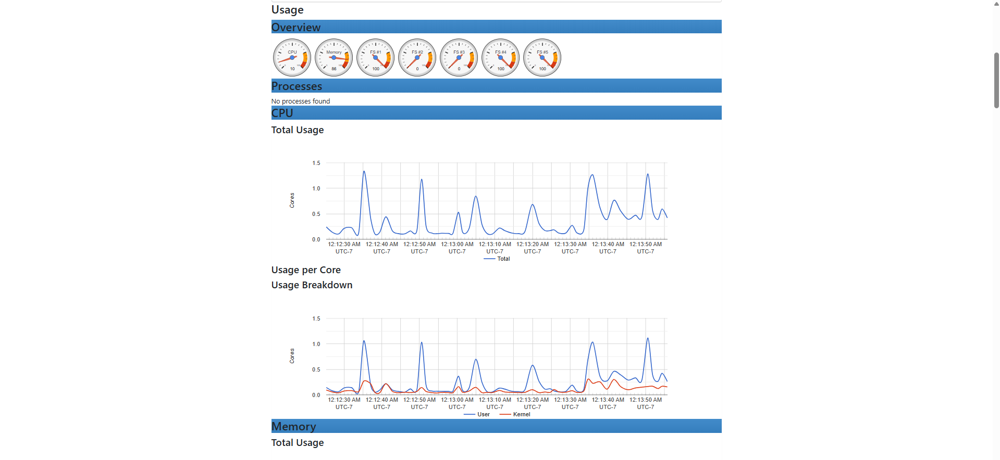

# cAdvisor

## Purpose

cAdvisor, or Container Advisor, collects resource-usage and performance information from Docker containers.

It provides metrics for:

- Container CPU usage
- Container memory usage
- Container network traffic
- Container filesystem activity
- Container uptime
- Container resource limits

Prometheus collects these metrics, and Grafana displays them in dashboards.

---

## Prerequisites

- Ubuntu Desktop 24.04 LTS
- Docker Engine
- Docker Compose
- Prometheus
- Grafana

---

## Installation

### Create the cAdvisor directory

```bash
mkdir -p ~/docker/cadvisor
cd ~/docker/cadvisor
```

### Create the Docker Compose file

Create:

```text
docker-compose.yml
```

The documented configuration is stored in:

```text
docker/cadvisor/docker-compose.yml
```

### Start cAdvisor

```bash
docker compose up -d
```

### Verify the container

```bash
docker compose ps
```

### View logs

```bash
docker compose logs --tail 50 cadvisor
```

---

## Docker Access

cAdvisor is granted access to Docker and host information through several mounted paths:

```text
/rootfs
/var/run
/sys
/var/lib/docker
```

Most mounts are read-only to reduce unnecessary write access.

The container runs with privileged access because it requires visibility into host and container resource information.

---

## Access cAdvisor

Open a browser and navigate to:

```text
http://<SERVER-IP>:8080
```

The Prometheus metrics endpoint is:

```text
http://<SERVER-IP>:8080/metrics
```

The exact server IP is intentionally omitted from this public repository.

---

## Prometheus Integration

cAdvisor is configured as a Prometheus scrape target under the job:

```text
cadvisor
```

The target can be verified at:

```text
http://<SERVER-IP>:9090/targets
```

Its status should display:

```text
UP
```

---

## Grafana Integration

Grafana queries the cAdvisor metrics stored in Prometheus.

The dashboard can display resource usage for containers such as:

- Jellyfin
- Portainer
- Homepage
- Sonarr
- Radarr
- Prowlarr
- Uptime Kuma
- Grafana
- Prometheus

---

## Current Status

- [x] cAdvisor installed
- [x] Running in Docker
- [x] Web interface accessible
- [x] Metrics endpoint accessible
- [x] Prometheus target reporting UP
- [x] Grafana integration configured
- [x] Added to Homepage
- [ ] Container alerting configured
- [ ] Automated backup configured

---

## What I Learned

- How cAdvisor collects Docker container metrics
- The difference between host metrics and container metrics
- How Prometheus scrapes cAdvisor
- How Grafana visualizes container resource utilization
- Why cAdvisor requires access to Docker host directories
- How to diagnose Prometheus targets showing UNKNOWN or DOWN

---

## Screenshot



---

## Future Improvements

- Configure container CPU alerts
- Configure container memory alerts
- Create a custom Docker dashboard
- Add container restart monitoring
- Add container filesystem alerts
- Review and reduce privileges where possible