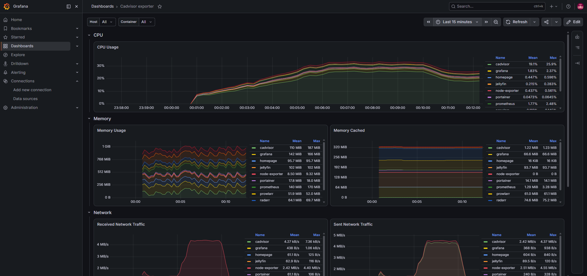

# Grafana

## Purpose

Grafana is a visualization and analytics platform used to display metrics collected from my homelab.

It provides dashboards for monitoring:

- CPU utilization
- Memory utilization
- Disk usage
- Network traffic
- System uptime
- Docker container resource usage

---

## Prerequisites

- Ubuntu Desktop 24.04 LTS
- Docker Engine
- Docker Compose
- Prometheus
- Node Exporter
- cAdvisor

---

## Installation

### Create the Grafana directory

```bash
mkdir -p ~/docker/grafana
cd ~/docker/grafana
```

### Create the environment file

```bash
nano .env
```

The environment file contains the administrator username and password and is not committed to GitHub.

### Create the Docker Compose file

Create:

```text
docker-compose.yml
```

The documented Compose configuration is stored in:

```text
docker/grafana/docker-compose.yml
```

### Start Grafana

```bash
docker compose up -d
```

### Verify the container

```bash
docker compose ps
```

### View logs

```bash
docker compose logs --tail 50 grafana
```

---

## Persistent Storage

Grafana data is stored in a Docker-managed named volume:

```text
grafana_data
```

This preserves:

- User accounts
- Dashboards
- Data sources
- Preferences
- Plugins

The named volume also avoids the host-directory permission problem encountered during the original deployment.

---

## Access Grafana

Open a browser and navigate to:

```text
http://<SERVER-IP>:3002
```

Grafana can also be accessed remotely through Tailscale:

```text
http://<TAILSCALE-IP>:3002
```

Exact IP addresses and credentials are intentionally excluded from this public repository.

---

## Prometheus Data Source

Prometheus was added as a Grafana data source.

The Prometheus server URL follows this format:

```text
http://<SERVER-IP>:9090
```

The connection was tested before importing dashboards.

---

## Dashboards

A Node Exporter dashboard was imported to display host metrics, including:

- CPU activity
- RAM usage
- Swap usage
- Filesystem utilization
- Network traffic
- System load
- Host uptime

A cAdvisor-compatible dashboard was also added for Docker container metrics.

---

## Current Status

- [x] Grafana installed
- [x] Running in Docker
- [x] Persistent named volume configured
- [x] Administrator account configured
- [x] Prometheus data source connected
- [x] Node Exporter dashboard imported
- [x] Host metrics displayed
- [x] Added to Homepage
- [ ] Alerting configured
- [ ] Dashboard provisioning automated
- [ ] Automated backup configured

---

## What I Learned

- How Grafana visualizes time-series metrics
- How to configure a Prometheus data source
- How Docker named volumes preserve Grafana data
- How container permissions can affect bind-mounted directories
- How to import and configure community dashboards
- Why credentials should be stored outside version control

---

## Screenshot



---

## Future Improvements

- Configure alert rules
- Add Docker container dashboards
- Create custom dashboards
- Provision data sources automatically
- Configure dashboard backups
- Add Grafana