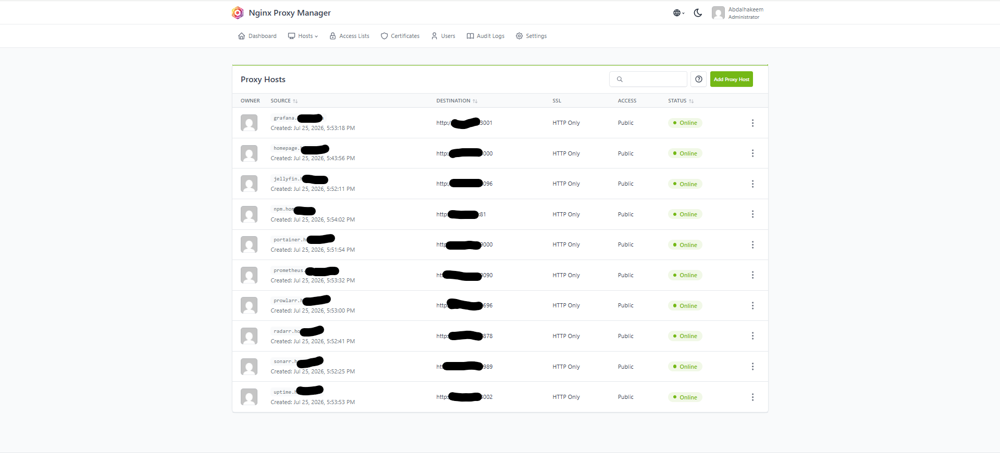

# Nginx Proxy Manager

## Purpose

Nginx Proxy Manager (NPM) provides a web interface for managing reverse proxies, SSL certificates, and custom hostnames for services running in my homelab.

Instead of accessing applications by IP address and port, NPM allows them to be reached through cleaner hostnames and centralized routing.

---

## Prerequisites

- Ubuntu Desktop 24.04 LTS
- Docker Engine
- Docker Compose

---

## Installation

### Create the directory

```bash
mkdir -p ~/docker/nginx-proxy-manager
cd ~/docker/nginx-proxy-manager
```

### Create the Docker Compose file

Create:

```text
docker-compose.yml
```

### Start the container

```bash
docker compose up -d
```

### Verify the container

```bash
docker compose ps
```

---

## Access

Open a browser and navigate to:

```text
http://<SERVER-IP>:81
```

On first login, Nginx Proxy Manager prompts for changing the default administrator email and password.

The exact server IP and credentials are intentionally excluded from this public repository.

---

## Features

- Reverse proxy management
- SSL certificate management
- Hostname routing
- HTTP to HTTPS redirection
- Web-based administration

---

## Current Status

- [x] Installed
- [x] Running in Docker
- [x] Web interface accessible
- [x] Added to Homepage
- [x] Reverse proxies configured
- [ ] SSL certificates configured

---

## What I Learned

- What a reverse proxy is
- How Nginx Proxy Manager simplifies proxy configuration
- How multiple services can share ports 80 and 443 through host-based routing
- Basic concepts of HTTPS certificate management

---

## Screenshot



---

## Future Improvements

- Configure reverse proxies for homelab services
- Add SSL certificates
- Enable HTTPS for internal services
- Explore custom domains