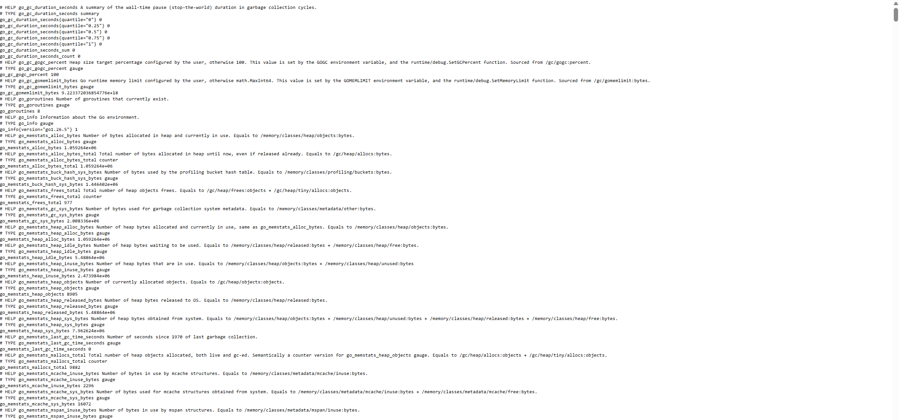

# Node Exporter

## Purpose

Node Exporter exposes Linux host-system metrics in a format that Prometheus can collect.

It provides information about:

- CPU usage
- Memory usage
- Filesystems
- Disk activity
- Network interfaces
- System load
- System uptime
- Swap usage

---

## Prerequisites

- Ubuntu Desktop 24.04 LTS
- Docker Engine
- Docker Compose
- Prometheus
- Grafana

---

## Installation

### Create the Node Exporter directory

```bash
mkdir -p ~/docker/node-exporter
cd ~/docker/node-exporter
```

### Create the Docker Compose file

Create:

```text
docker-compose.yml
```

The documented configuration is stored in:

```text
docker/node-exporter/docker-compose.yml
```

### Start Node Exporter

```bash
docker compose up -d
```

### Verify the container

```bash
docker compose ps
```

### View logs

```bash
docker compose logs --tail 50 node-exporter
```

---

## Host Access

Node Exporter uses:

```yaml
network_mode: host
pid: host
```

The host root filesystem is mounted read-only at:

```text
/host
```

The following command option tells Node Exporter where the host root filesystem is mounted:

```text
--path.rootfs=/host
```

This allows the container to collect metrics from the Ubuntu host rather than only from inside the container.

---

## Access Metrics

The Node Exporter metrics endpoint is:

```text
http://<SERVER-IP>:9100/metrics
```

The exact server IP is intentionally omitted from this public repository.

The metrics endpoint displays raw Prometheus-formatted data and is not intended to be a graphical dashboard.

---

## Prometheus Integration

Node Exporter is configured as a Prometheus scrape target under the job:

```text
node-exporter
```

The target can be verified through:

```text
http://<SERVER-IP>:9090/targets
```

The target should display:

```text
UP
```

---

## Grafana Integration

Grafana reads Node Exporter metrics from Prometheus.

A Node Exporter dashboard was imported to visualize:

- CPU utilization
- Memory utilization
- Disk usage
- Network traffic
- System load
- System uptime

---

## Current Status

- [x] Node Exporter installed
- [x] Running in Docker
- [x] Host networking configured
- [x] Host filesystem mounted read-only
- [x] Metrics endpoint accessible
- [x] Prometheus target reporting UP
- [x] Grafana dashboard displaying metrics
- [ ] Additional collectors evaluated
- [ ] Alerting rules configured

---

## What I Learned

- How exporters expose system metrics
- Why Node Exporter requires host-level access
- How Linux host metrics differ from container metrics
- How Prometheus scrapes an exporter endpoint
- How Grafana visualizes Node Exporter data
- Why host filesystems should be mounted read-only

---

## Screenshot



---

## Future Improvements

- Configure CPU alerts
- Configure memory alerts
- Configure disk-space alerts
- Monitor external storage
- Add temperature metrics if supported
- Evaluate additional Node Exporter collectors