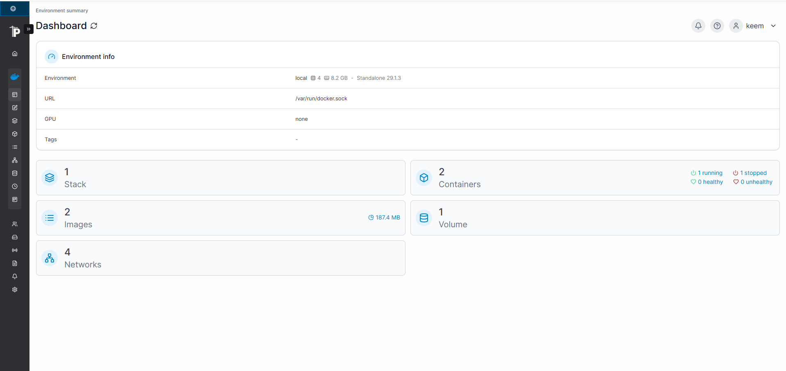

# Portainer

## Purpose

Portainer is a web-based interface for managing Docker containers, images, networks, and volumes. It simplifies Docker management without needing to use the terminal for every task.

---

## Installation

### Prerequisites

- Ubuntu Desktop 24.04 LTS
- Docker Engine
- Docker Compose

### Create Portainer Data Volume

```bash
docker volume create portainer_data
```

### Deploy Portainer

```bash
docker run -d \
  --name portainer \
  --restart unless-stopped \
  -p 8000:8000 \
  -p 9443:9443 \
  -v /var/run/docker.sock:/var/run/docker.sock \
  -v portainer_data:/data \
  portainer/portainer-ce:latest
```

### Access Portainer

Open a browser and navigate to:

```
https://<SERVER-IP>:9443
```

Example:

```
https://10.0.0.xxx:9443
```

Create the administrator account and connect the local Docker environment.

---

## Current Status

- [x] Portainer installed
- [x] Running in Docker
- [x] Local Docker environment connected
- [x] Accessible through web browser
- [x] Docker socket configured

---

## What I Learned

- How Docker containers are deployed
- How Docker volumes store persistent data
- How Portainer communicates with Docker using `/var/run/docker.sock`
- Basic Docker container management through a web interface

---

## Screenshot




## Future Improvements

- Deploy additional services using Docker Compose
- Manage all containers through Portainer
- Organize services into Docker stacks
- Monitor container resource usage
