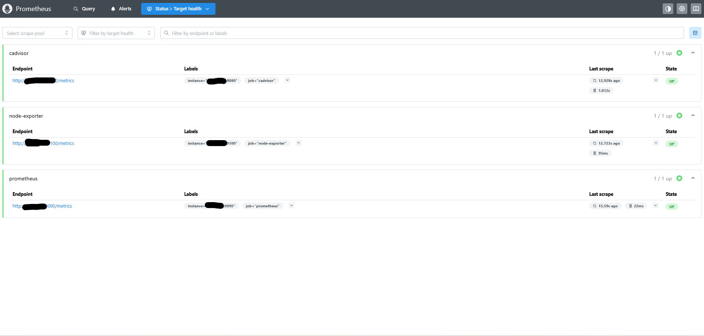

# Prometheus

## Purpose

Prometheus is a monitoring and time-series database used to collect metrics from my homelab.

It collects metrics from:

- Prometheus itself
- Node Exporter
- cAdvisor

Grafana uses Prometheus as its data source to display dashboards and historical performance information.

---

## Prerequisites

- Ubuntu Desktop 24.04 LTS
- Docker Engine
- Docker Compose
- Node Exporter
- cAdvisor
- Grafana

---

## Installation

### Create the Prometheus directory

```bash
mkdir -p ~/docker/prometheus
cd ~/docker/prometheus
```

### Create the Docker Compose file

Create:

```text
docker-compose.yml
```

### Create the Prometheus configuration

Create:

```text
prometheus.yml
```

The repository versions are stored in:

```text
docker/prometheus/docker-compose.yml
docker/prometheus/prometheus.yml
```

### Validate the configuration

```bash
docker run --rm \
  -v "$PWD/prometheus.yml:/etc/prometheus/prometheus.yml:ro" \
  prom/prometheus \
  promtool check config /etc/prometheus/prometheus.yml
```

### Start Prometheus

```bash
docker compose up -d
```

### Verify the container

```bash
docker compose ps
```

### View logs

```bash
docker compose logs --tail 50 prometheus
```

---

## Persistent Storage

Prometheus stores collected metrics in the named Docker volume:

```text
prometheus_data
```

This preserves historical metrics when the container is recreated.

---

## Access Prometheus

Open a browser and navigate to:

```text
http://<SERVER-IP>:9090
```

The target-status page is available at:

```text
http://<SERVER-IP>:9090/targets
```

Exact IP addresses are intentionally excluded from this public repository.

---

## Scrape Targets

The following jobs are configured:

| Job | Purpose | Port |
|-----|---------|------|
| Prometheus | Monitors the Prometheus server | 9090 |
| Node Exporter | Collects host-system metrics | 9100 |
| cAdvisor | Collects Docker container metrics | 8080 |

Each target should display:

```text
UP
```

on the Prometheus Targets page.

---

## Current Status

- [x] Prometheus installed
- [x] Running in Docker
- [x] Persistent storage configured
- [x] Prometheus self-monitoring configured
- [x] Node Exporter target configured
- [x] cAdvisor target configured
- [x] All targets reporting UP
- [x] Connected to Grafana
- [x] Added to Homepage
- [ ] Alertmanager configured
- [ ] Retention settings customized
- [ ] Automated backup configured

---

## What I Learned

- How Prometheus collects time-series metrics
- How scrape jobs and targets are configured
- How to validate configuration files with promtool
- How Prometheus integrates with exporters
- How Grafana queries Prometheus
- How target health is inspected through the Targets page
- How Docker volumes preserve historical metrics

---

## Screenshot



---

## Future Improvements

- Configure Alertmanager
- Add service-specific exporters
- Configure metric-retention limits
- Add recording rules
- Add alerting rules
- Automate configuration validation
- Back up Prometheus configuration