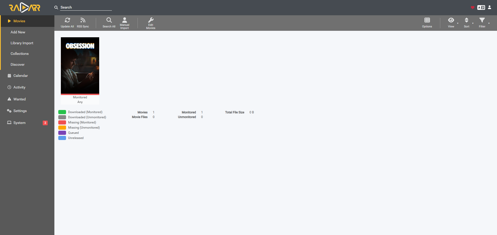

# Radarr

## Purpose

Radarr is a self-hosted movie management application. It is used to organize, rename, monitor, and manage movie files for my Jellyfin media library.

Radarr does not provide media by itself. It manages movie files and integrates with other services that are configured separately.

---

## Prerequisites

- Ubuntu Desktop 24.04 LTS
- Docker Engine
- Docker Compose
- Jellyfin
- Homepage
- Tailscale
- A Movies media directory

---

## Folder Structure

The Movies directory on the Ubuntu server is:

```text
/home/ahmad-saeed/media/movies
```

Inside the Radarr container, the Movies directory is available as:

```text
/data/movies
```

---

## Installation

### Create the Radarr directory

```bash
mkdir -p ~/docker/radarr
mkdir -p ~/media/movies
cd ~/docker/radarr
```

### Create the Docker Compose file

Create:

```text
docker-compose.yml
```

The Compose configuration is stored in:

```text
docker/radarr/docker-compose.yml
```

### Start Radarr

```bash
docker compose up -d
```

### Verify the container

```bash
docker compose ps
```

or

```bash
docker ps
```

### View logs

```bash
docker compose logs --tail 50 radarr
```

---

## Access Radarr

Open a browser on the local network and navigate to:

```text
http://<SERVER-IP>:7878
```

Radarr can also be accessed remotely using the server's Tailscale IP:

```text
http://<TAILSCALE-IP>:7878
```

The exact IP addresses are intentionally omitted from this public repository.

---

## Authentication

Radarr authentication was configured using:

```text
Forms (Login Page)
```

Authentication is required for both local and remote connections.

Credentials are not stored in this repository.

---

## Media Management

The Radarr root folder is:

```text
/data/movies
```

The following media-management options were enabled:

- Rename Movies
- Create Movie Folders

These settings help keep the movie library organized for Jellyfin.

---

## Current Status

- [x] Radarr installed
- [x] Running in Docker
- [x] Web dashboard accessible
- [x] Authentication configured
- [x] Movie root folder configured
- [x] Added to Homepage
- [ ] Download client configured
- [ ] Indexer manager configured
- [ ] Test movie imported
- [ ] Automated backup configured

---

## What I Learned

- How to deploy Radarr using Docker Compose
- How Docker bind mounts connect host folders to container paths
- How Radarr organizes and renames movie files
- How authentication protects self-hosted applications
- How consistent Docker paths simplify media management
- How Radarr integrates with Jellyfin for movie organization

---

## Screenshot



---

## Future Improvements

- Install Prowlarr
- Configure a download client
- Test importing a movie
- Configure automated backups
- Add Radarr monitoring widgets to Homepage
- Expand the movie library using external storage