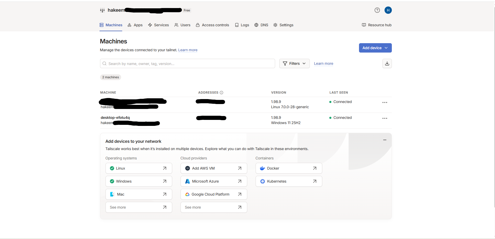

# Tailscale

## Purpose

Tailscale provides secure remote access to my homelab through a private encrypted network. It allows approved devices to connect to the Ubuntu server without exposing services directly to the public internet or configuring router port forwarding.

---

## Prerequisites

- Ubuntu Desktop 24.04 LTS
- Internet connection
- Tailscale account
- Another device connected to the same Tailscale account

---

## Installation

### Install curl

```bash
sudo apt update
sudo apt install curl -y
```

### Install Tailscale

```bash
curl -fsSL https://tailscale.com/install.sh | sh
```

### Enable the Tailscale service

```bash
sudo systemctl enable --now tailscaled
```

### Verify the service

```bash
sudo systemctl status tailscaled
```

The service should display:

```text
active (running)
```

Press `q` to exit the status screen.

---

## Authentication

Run:

```bash
sudo tailscale up
```

Tailscale provides an authentication link. Open the link in a browser, sign in, and approve the Ubuntu server.

---

## Verify the Connection

Check connected devices:

```bash
tailscale status
```

Display the server's Tailscale IP address:

```bash
tailscale ip
```

The exact Tailscale IP is intentionally omitted from this public repository.

---

## Remote Jellyfin Access

Install Tailscale on the client device and sign in with the same account.

Access Jellyfin using:

```text
http://<TAILSCALE-IP>:8096
```

This allows Jellyfin to be accessed remotely without exposing port `8096` through the home router.

---

## Current Status

- [x] Tailscale installed on Ubuntu
- [x] Tailscale service enabled
- [x] Ubuntu server authenticated
- [x] Windows PC authenticated
- [x] Devices connected to the same tailnet
- [x] Jellyfin accessible through Tailscale
- [ ] Mobile device tested outside the home network

---

## Security Notes

- No router port forwarding is configured
- The exact Tailscale IP is not published
- Only authenticated tailnet devices can connect
- Authentication links and keys should never be committed to GitHub

---

## What I Learned

- How private overlay networks connect remote devices
- How to securely access a home server without port forwarding
- How systemd manages the Tailscale service
- How Tailscale IP addresses differ from local network IP addresses
- How to access Jellyfin remotely through a private network

---

## Screenshot



## Future Improvements

- Install Tailscale on my phone
- Test Jellyfin using cellular data
- Configure MagicDNS
- Review device access permissions
- Configure Tailscale SSH