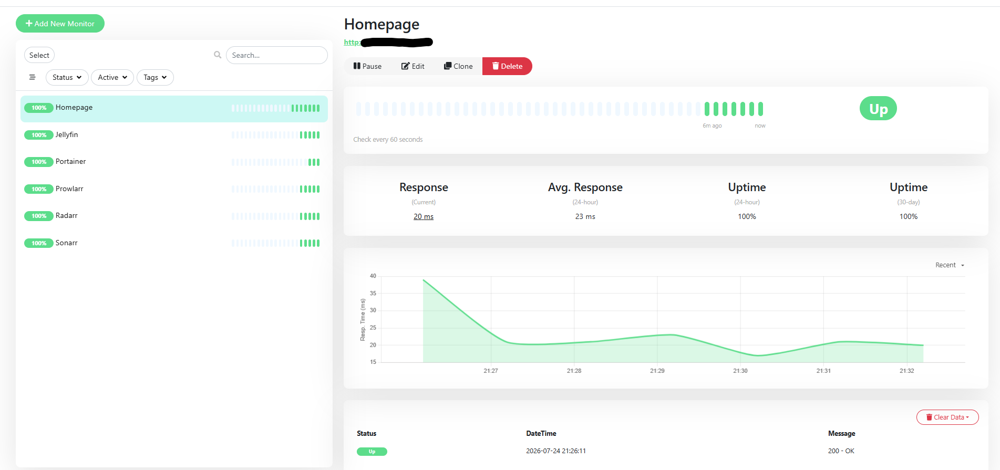

# Uptime Kuma

## Purpose

Uptime Kuma is a self-hosted monitoring application used to monitor the availability and health of services running in my homelab.

It continuously checks whether services are online and provides a web dashboard showing their status and uptime history.

---

## Prerequisites

- Ubuntu Desktop 24.04 LTS
- Docker Engine
- Docker Compose
- Homepage
- Tailscale

---

## Installation

### Create the Uptime Kuma directory

```bash
mkdir -p ~/docker/uptime-kuma
cd ~/docker/uptime-kuma
```

### Create the Docker Compose file

Create:

```text
docker-compose.yml
```

The Compose configuration is stored in:

```text
docker/uptime-kuma/docker-compose.yml
```

### Start Uptime Kuma

```bash
docker compose up -d
```

### Verify the container

```bash
docker compose ps
```

or

```bash
docker ps
```

### View logs

```bash
docker compose logs --tail 50 uptime-kuma
```

---

## Access Uptime Kuma

Open a browser on the local network and navigate to:

```text
http://<SERVER-IP>:3001
```

Uptime Kuma can also be accessed remotely through Tailscale:

```text
http://<TAILSCALE-IP>:3001
```

The exact IP addresses are intentionally omitted from this public repository.

---

## Authentication

An administrator account was created during the initial setup.

Credentials are intentionally excluded from this repository.

---

## Monitored Services

Current monitors include:

- Homepage
- Portainer
- Jellyfin
- Sonarr
- Radarr
- Prowlarr
- Uptime Kuma

Portainer is monitored using HTTPS with self-signed certificate verification disabled because it uses the default self-signed certificate.

---

## Current Status

- [x] Uptime Kuma installed
- [x] Running in Docker
- [x] Web dashboard accessible
- [x] Administrator account configured
- [x] Homepage monitor configured
- [x] Portainer monitor configured
- [x] Jellyfin monitor configured
- [x] Sonarr monitor configured
- [x] Radarr monitor configured
- [x] Prowlarr monitor configured
- [x] Added to Homepage
- [x] Email notifications configured
- [ ] Status page published

---

## What I Learned

- How to deploy Uptime Kuma with Docker Compose
- How HTTP and HTTPS monitoring works
- How to monitor self-hosted services
- How self-signed certificates affect HTTPS monitoring
- How uptime monitoring improves homelab reliability
- How to centralize service health monitoring

---

## Screenshot



---

## Future Improvements

- Configure email notifications
- Create a public status page
- Add response time monitoring
- Add SSL certificate expiration monitoring
- Monitor internet connectivity
- Integrate with Grafana for centralized dashboards